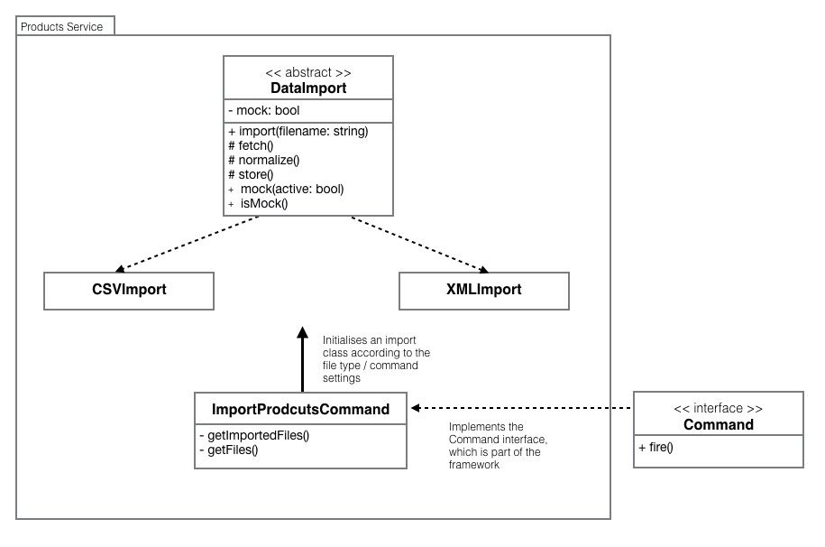

The repository contains my solution for a task given by Saitow.ag

<h3>Background</h3>
The tasks requires a module that will load products from multiple sources and display them to the end user.
A search functionality must also exist, as well as a product page view

<h3>My approach</h3>
I have decided to take the task a step further and provide a more production ready solution to the problem. My solution includes 3 services (each running in their own container):

  1. ElasticSearch Service - I chose ElasticSearch mainly due to its performance when performing a text search. ElasticSearch will store all of the products and would provide the normalised data for the front end

  2. Products service - Using Lumen micro-framework, will handle all product related actions. The service will include a command that imports data from various sources. <small>* The current solution will only support importing from files, but the command can be extended to support DB imports as well</small>

  3. Client SPA service - Using ReactJS, the application will provide a products, product and search results pages

<h3>Products Service</h3>

The idea is to have a directory that has all of the data files we want to import (Later on we can build an admin panel to upload files into that directory, and/or extend the functionality to support data import from a DB as well)

The service will have a command that will check if there are any files that need to be imported (by comparing the files in the directory vs. what's in the DB) - Using the framework's 'Command' functionality

If a file hasn't been imported, we will check its type and call a matching import class to handle the fetching, normalizing and storing of the data

<h5>Planned Testing</h5>

Testing the command will be done using a <i>mock</i> directory that contains files similar to the files we plan to import

The test will only check the normalization stage, as we can assume that the framework knows how to store data in the DB
